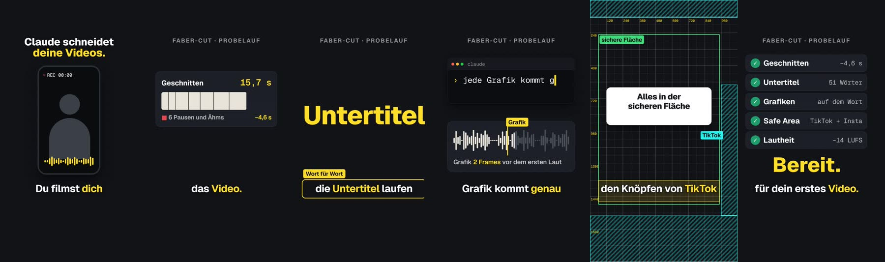
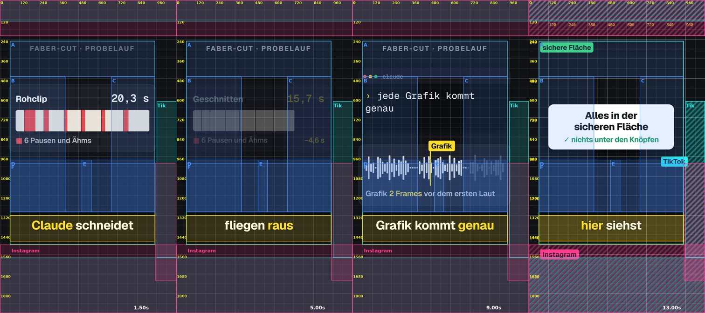

# faber-cut

[](https://github.com/TobiB1505/faber-cut/actions/workflows/test.yml)

**Claude schneidet deine Videos.** Du filmst dich mit dem Handy, gibst Claude Code die Rohclips und sagst "schneide mir
dieses Video". Raus kommt ein fertiges Reel für Instagram und TikTok (1080x1920):

- Füllwörter, Versprecher und Pausen raus, ohne Mini-Jump-Cuts,
- Untertitel Wort für Wort,
- Motion Graphics, die genau auf dem gesprochenen Wort kommen (2 Frames vor dem ersten Laut, gemessen),
- alles in der sicheren Fläche, nichts unter den Knöpfen von TikTok und Instagram (mit Raster geprüft),
- Splitscreen für Tool-Erklärungen, J-Cuts, Soundeffekte leise unter der Stimme,
- Lautheit auf -14 LUFS, fertig zum Hochladen.



*Der Probelauf, den jeder nach dem Einrichten bekommt: 20,3 s Rohclip mit "Ähm" und Pausen werden zu 15,7 s. Alle
Zahlen im Bild kommen aus dem echten Schnitt.*

Das ist der Skill, mit dem ich jedes Video von **Marketing Faber** schneiden lasse, mit allen Skripten, die über die
Tage dazugekommen sind.

**Er kostet nichts:**
- faber-cut ist frei (MIT).
- Transkription, Schnitt und Render laufen ohne bezahlte Dienste.
- Die optionale Gemini-Prüfung geht mit einem kostenlosen Schlüssel.

Du brauchst nur Claude Code.

> **Wichtig:** Mein Skill schneidet am Anfang in **meinem** Stil. Beim Einrichten fragt Claude dich nach deinem
> (Untertitel, Grafiken, Tempo, Farbe), und nach jedem Video sagst du, was du anders willst: Claude schreibt es in
> deinen Stil. Nach ein paar Videos ist es dein Schnitt.

## Los geht's: ein Prompt

Kopiere diesen Satz in Claude Code und schick ihn ab:

```
Installiere faber-cut von github.com/TobiB1505/faber-cut und richte es für mich ein.
```

- **Lokal:** Starte Claude Code in dem Ordner, in dem faber-cut landen soll (Terminal oder Desktop-App). Noch kein
  Claude Code? [Hier installieren](https://claude.com/claude-code).
- **Online:** Öffne [claude.ai/code](https://claude.ai/code) oder die Claude-App und starte eine Sitzung. Rechne
  dort mit **zwei Sitzungen**: In einer normalen Cloud-Sitzung sperrt das Netzwerk die Seiten, von denen faber-cut
  seine Sprachmodelle, PyTorch und deine Clips holt. Die erste Sitzung richtet darum eine eigene Cloud-Umgebung mit
  dir ein, erst in der zweiten wird installiert (siehe [Was danach online passiert](#was-danach-online-passiert)).

Mehr musst du nicht tun. Claude lädt faber-cut und startet das **Onboarding**, einen Skill, der dich Schritt für
Schritt mit Auswahlfragen durchführt:
- Jeder Schritt hat höchstens drei Handgriffe.
- Jeder Schritt sagt dir, woran du siehst, dass er geklappt hat.
- Erst nach deinem "Erledigt" geht es weiter.

Du musst nichts über Terminal, Python oder API-Schlüssel wissen. Als Erstes fragt Claude, wo faber-cut laufen soll:

| | **Lokal** (auf deinem Computer) | **Online** (Claude Code im Browser oder in der App) |
| --- | --- | --- |
| Für wen | Windows, Mac mit Apple-Chip oder Linux, ~8 GB frei | Claude-Plan mit Cloud-Sitzungen (Pro, Max, Team) |
| Clips | legst du in den Ordner `eingang/` | lädst du vom Handy in einen Google-Drive-Ordner |
| Fertiges Video | liegt in `out/final/` | kommt in den Chat |
| Installieren | Node.js und ffmpeg (Claude hilft) | nichts; dafür eine eigene Cloud-Umgebung (7 Klicks) und einmal neu starten |

### Was danach lokal passiert

Claude prüft, ob Node.js und ffmpeg da sind, und installiert, was fehlt (du bestätigst nur die Rückfrage):
- Windows: per `winget`
- Mac: per Homebrew
- Linux: per Paketmanager

Dann läuft `npm run setup`. Es holt sich ein eigenes Python, die Pakete und die Sprachmodelle, ~4 GB. In der Zeit
fragt dich Claude nach deinem Stil und ob du die Gemini-Prüfung willst. Am Ende sagt es dir, dass du Claude Code
künftig im Ordner `faber-cut` startest.

### Was danach online passiert

**Wichtig:** In einer normalen Cloud-Sitzung läuft faber-cut noch nicht. Ihr Netzwerk lässt nur die üblichen
Paketquellen durch, aber nicht `huggingface.co` (Sprachmodelle), `download.pytorch.org` (PyTorch) und Google Drive
(deine Clips). Darum geht es online in zwei Sitzungen:
- **Sitzung 1** (die, in der du den Prompt schickst): Stil, Einstellungen und die Klick-Schritte unten, darunter eine
  eigene Cloud-Umgebung `faber-cut`, die diese Seiten erlaubt. Hier wird noch nichts installiert.
- **Sitzung 2** (neu gestartet, in der Umgebung `faber-cut`): Claude installiert alles und macht den Probelauf.

Claude führt dich durch alles, was nur du draußen klicken kannst:
1. **Eine eigene Kopie** von faber-cut auf GitHub (ein Fork), damit dein Stil und deine Projekte gespeichert werden.
   Danach startest du eine Sitzung mit deiner Kopie.
2. Die Fragen zu deinem **Stil** und zur Gemini-Prüfung.
3. **Sieben kurze Klick-Schritte** von je etwa einer Minute:
   1. Drive-Ordner anlegen.
   2. Den Ordner freigeben.
   3. Gemini-Schlüssel holen (fällt weg, wenn du Gemini nicht willst).
   4. Cloud-Umgebung anlegen.
   5. Internet-Freigaben eintragen.
   6. Setup-Skript einfügen.
   7. Google Drive verbinden.

Danach startest du einmal eine neue Sitzung in der Umgebung `faber-cut`, und Claude macht den Rest.

Abkürzung: Stellst du in deiner Cloud-Umgebung **Network access** auf **Full**, ist alles erreichbar und die
Internet-Freigaben (Schritt 5) fallen weg. Das ist einfacher, aber offener: Claude darf dann jede Seite aufrufen.

Warum der Ordner für "Jeder mit dem Link" freigegeben wird: Über die Drive-Verbindung kann Claude nur kleine Dateien
lesen. Videos lädt es in voller Größe über den Link.

### Was das Onboarding dich fragt

- **Sprache** deiner Videos (Deutsch, Englisch oder beides)
- **Untertitel:** Wort für Wort oder keine
- **Grafiken:** viele, wenige oder keine
- **Tempo:** ab welcher Pause geschnitten wird
- **Akzentfarbe**, **Soundeffekte**, **Zooms**, **Hook-Titel** mit oder ohne Serienname, typische **Videolänge**

Daraus schreibt Claude deinen Stil (`.claude/skills/faber-cut/stil.md`) und stellt die Vorlage darauf ein.

### Der Probelauf

Zum Schluss schneidet `npm run probelauf` einen 20-Sekunden-Beispielclip einmal komplett durch, mit genau den
Schritten, die auch dein Video durchläuft:
1. vorbereiten
2. transkribieren
3. ausrichten
4. nach Text schneiden
5. Vorschau
6. Vollversion
7. Raster
8. Prüfungen

Das Video oben ist dieses Ergebnis. Läuft der Probelauf durch, ist alles eingerichtet. `npm run doktor` sagt dir
jederzeit, ob alles bereit ist, und bei jedem Problem, wie du es behebst.

<details>
<summary><b>Ohne Prompt, von Hand</b> (wenn du das Repo lieber selbst holst)</summary>

**Lokal:**
```bash
git clone https://github.com/TobiB1505/faber-cut.git
cd faber-cut
claude
```
(Ohne git: auf GitHub **Code → Download ZIP**, entpacken, im Terminal in den Ordner wechseln, `claude`.) Dann
schreib **"Richte faber-cut für mich ein."**

**Online:** Mach auf GitHub eine eigene Kopie ([dieses Repo](https://github.com/TobiB1505/faber-cut) öffnen, oben
rechts **Fork**; privat geht es über [github.com/new/import](https://github.com/new/import) mit dieser Adresse).
Starte auf [claude.ai/code](https://claude.ai/code) eine Sitzung mit deiner Kopie und schreib **"Richte faber-cut für
mich ein."**

Ab da läuft dasselbe Onboarding wie mit dem Prompt.

</details>

## Dein erstes Video

**Lokal:** Leg den Clip in `eingang/` und schreib "Schneide mir das Video in eingang/IMG_0871.MOV. Projekt: video1".
**Online:** Lade den Clip vom Handy in deinen Drive-Ordner und schreib "Clips sind drin, schneide mir das Video".

Dann:
1. Claude bereitet den Clip vor, transkribiert ihn und schlägt dir **drei Fassungen als Text** vor: komplett,
   gestrafft, knackig. Du wählst eine.
2. Claude schneidet, baut die Grafiken und schickt dir eine **Vorschau**. Dazu kommen die eigenen Messungen (Sync,
   Tempo, Raster) und, wenn du willst, zwei Gemini-Kritiken.
3. Du sagst, was dir nicht gefällt ("Pacing straffer", "der Aufruf ans Ende"). Claude setzt es um und merkt sich
   Geschmacksfragen in deinem Stil.
4. Du sagst "passt", Claude rendert die **Vollversion** und prüft sie. Du bekommst drei Dateien:
   - das Master
   - `-post.mp4` für Instagram/TikTok
   - `-chat.mp4` unter 29 MB

Tipp: Gib Claude schon beim Filmen Anweisungen. Sag im Clip "Claude, füg hier oben rechts das GitHub-Logo ein" und
rede weiter: Claude setzt es um und schneidet die Anweisung raus.

## So funktioniert es

```
Rohclip ──npm run intake──► Take (Stimme entrauscht, 1080x1920)
                       ├─ transcribe.py   faster-whisper, lokal, gebündelt (4 min Ton in ~2,5 min)
                       └─ align.py        Wortzeiten per wav2vec2 auf den Frame genau
schnitt.json ──npm run schnitt──► cut.json   Sätze als Text: was im Text fehlt, fliegt raus
                       └─ fillerscan      findet "ähs", die Whisper nicht aufgeschrieben hat
Video.tsx (Remotion) ──► npm run vorschau    10-s-Stücke mit Cache, nur Geändertes neu
                       ├─ npm run sync    kommt jede Grafik wirklich auf ihrem Wort? (gemessen am Video)
                       ├─ npm run raster  liegt alles in der sicheren Fläche, frei von den Knöpfen von TikTok/Instagram?
                       └─ npm run pacing  wo passiert länger als 2 s nichts?
npm run final ──► Master, Post- und Chat-Version, -14 LUFS
                       └─ npm run checks  Ausreißer-Frames, Lautheit, Tonlöcher, Effekte unter der Stimme
```

**Warum nach Text schneiden?** Weil Claude so nie ein Wort verliert und nie mitten in einem Wort schneidet:
- Die Fassung, die du wählst, ist ein Text, und `schnitt.py` richtet ihn am Transkript aus.
- Alles, was im Text fehlt (ein "äh", ein Versprecher, ein "Dann,"), wird zu einem Schnitt.
- Danach prüft es, ob die Untertitel Wort für Wort deinem Text entsprechen.

**Warum Wort-Ausrichtung?** Whisper schätzt Wortzeiten und liegt 0,1-0,3 s daneben. Eine Grafik, die darauf gesetzt
wird, wirkt asynchron. `align.py` legt jedes Wort auf seinen echten ersten Laut, und jede Grafik kommt 2 Frames
davor. Das ist der Unterschied zwischen "irgendwie passend" und "auf den Punkt".

### Das Raster: wohin eine Grafik darf



TikTok und Instagram legen ihre Knöpfe und Texte über dein Video:
- oben die Leiste,
- rechts Like, Kommentar und Teilen,
- unten Name, Beschreibung und Ton.

Was dort liegt, sieht niemand. `npm run raster` zeichnet auf jedes Bild:
- ein 60-px-Raster mit Pixelwerten,
- die **sichere Fläche** (grün),
- das Untertitel-Band (gelb),
- die Zonen von **TikTok** (türkis) und **Instagram** (pink),
- deinen Kopf (rot).

Für jeden Zeitpunkt nennt es außerdem die freien Felder. Claude nutzt das zweimal:
1. Vor dem Platzieren, auf deinem Rohclip, damit es nach Zahlen platziert und nicht nach Gefühl.
2. Nach dem Rendern, auf der Vorschau, als Prüfung: Jede Grafik muss ganz in der grünen Fläche liegen, nichts auf
   deinem Kopf.

Die Maße stehen in `src/lib/zonen.json`. Die Apps veröffentlichen keine offiziellen Maße für normale Posts, darum sind
die Werte vorsichtig gewählt und decken die Angaben aller Quellen ab (Datum und Quellen stehen in der Datei).

## Ordner

| Ordner / Datei | Inhalt |
| --- | --- |
| `.claude/skills/faber-cut/` | der Skill: `SKILL.md` (der Ablauf) und `stil.md` (**dein Geschmack**, wächst mit) |
| `.claude/skills/skill-onboarding/` | das Onboarding beim ersten Start, mit allen Klickpfaden (`anleitungen.md`) |
| `faber-cut.json` | deine Einstellungen aus dem Onboarding (lokal/online, Sprache, Gemini, Drive-Ordner) |
| `tools/` | die Werkzeuge (Python und Node), jedes mit Erklärung im Kopf der Datei |
| `src/lib/` | Remotion-Bausteine: Zeitachse (`schnitt.ts`), Untertitel, Titel, Splitscreen, J-Cuts, `stil.ts`, Raster (`raster.tsx`, `zonen.json`) |
| `src/projekte/_vorlage/` | Vorlage für jedes neue Video |
| `src/projekte/<projekt>/` | deine Videos: `schnitt.json`, `cut.json`, `Video.tsx` |
| `public/projekte/` | deine Takes und Transkripte (bleiben privat, nicht im Git) |
| `eingang/` | hier legst du Rohclips ab (nicht im Git) |
| `beispiel/` | der Probelauf: der Rohclip `probe.mp4` (Stimme synthetisch, mit "Ähm" und Pausen) und `Probelauf.tsx` |
| `out/` | Vorschauen und fertige Videos |

## Befehle (macht normalerweise Claude für dich)

Alle Befehle sind gleich auf Windows, macOS und Linux:

```bash
npm run setup                                   # einrichten (einmal; wiederholbar)
npm run doktor                                  # prüfen, ob alles bereit ist
npm run probelauf                               # Beispielclip einmal komplett schneiden
npm run intake -- eingang/clip.mov video1 t1    # Clip vorbereiten, transkribieren, ausrichten
npm run raster -- public/projekte/video1/takes/t1.mp4 out/raster.jpg 2,10,20   # wohin Grafiken dürfen
npm run schnitt -- src/projekte/video1/schnitt.json
npm run fillerscan -- src/projekte/video1/cut.json
npm run studio                                  # Remotion Studio zum Durchklicken
npm run vorschau -- Video1                      # Vorschau (halbe Größe, mit Cache)
npm run sync -- out/vorschau/Video1.mp4 src/projekte/video1/cut.json github remotion
npm run pacing -- out/vorschau/Video1.mp4 src/projekte/video1/cut.json
npm run still -- Video1 out/still.jpg --frame=120 --props='{"raster":true}'    # Standbild mit Raster
npm run gemini -- out/vorschau/Video1.mp4 prompts/review.md                    # optional
npm run final -- Video1                         # Vollversion
npm run checks -- out/final/Video1.mp4 --stems Video1
```

## Optional: Gemini als zweite Meinung

Mit einem kostenlosen Schlüssel von [Google AI Studio](https://aistudio.google.com/apikey) lässt Claude jede Vorschau von
Gemini ansehen und anhören (`npm run gemini`, Prompt in `prompts/review.md`). Das läuft immer zweimal, weil Gemini sich
oft irrt, und Claude prüft jede Behauptung nach, bevor es etwas ändert.

Wohin der Schlüssel kommt:
- **Lokal:** in die Datei `.env` (`GEMINI_API_KEY=…`, nicht im Git).
- **Online:** in die Umgebungsvariablen der Cloud-Umgebung.

Er kommt nie in den Chat. Das Onboarding zeigt dir beides.

Achtung: Dafür geht die Vorschau an Google, und beim kostenlosen Schlüssel darf Google sie zur Verbesserung seiner
Dienste nutzen.

## Gut zu wissen

- **Dauer** (gemessen auf einem normalen Server):
  - Einrichten: 5-15 Minuten, je nach Internet.
  - Probelauf: ~4 Minuten.
  - 4K-Clip von 40 s: Vorbereiten ~6 Minuten, Vorschau ~40 s für 15 s Video, Vollversion ~2,5 Minuten.
  - Video von 1:45: Vorschau ~4 Minuten, Vollversion ~8 Minuten.
- **Getestet** wird jede Änderung automatisch auf Windows, macOS und Linux: Einrichtung, Typecheck, Doktor und der
  komplette Probelauf (GitHub Actions, `.github/workflows/test.yml`, Status oben im Badge).
- **Nicht unterstützt:** Macs mit Intel-Chip und Windows auf ARM. Für sie gibt es die nötigen KI-Pakete nicht mehr.
  Nimm dort den Online-Modus.
- **Remotion** ist für Einzelpersonen und kleine Firmen (bis 3 Personen) kostenlos; größere Firmen brauchen eine
  [Remotion-Lizenz](https://www.remotion.dev/license).
- **Sprachen:** Deutsch und Englisch sind eingerichtet. Für andere Sprachen nimmt `npm run ausrichten -- … --modell`
  jedes wav2vec2-CTC-Modell von Hugging Face.
- Schrift: [Geist](https://vercel.com/font) (SIL Open Font License). Die Soundeffekte sind selbst synthetisiert und frei.
  Die Stimme im Beispielclip ist synthetisch (Gemini TTS).

## Lizenz

MIT, siehe [LICENSE](LICENSE). Nimm es, bau es um, mach es zu deinem.
